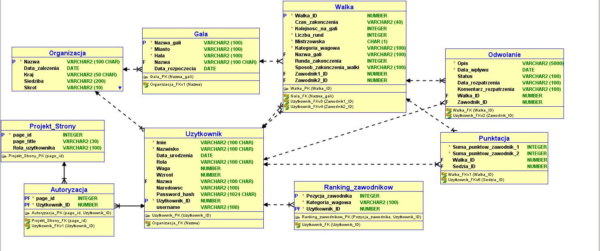

# 🥋 Sztuki Walki – Aplikacja Oracle APEX

**Sztuki Walki** to aplikacja internetowa zbudowana w Oracle APEX służąca do zarządzania galami sportowymi, walkami, zawodnikami, rankingami oraz punktacją i odwołaniami. Projekt zawiera kompleksowy model relacyjnej bazy danych oraz gotową aplikację webową.

## 📽 Demo aplikacji
Zobacz film prezentujący działanie aplikacji na YouTube:  
👉 [https://studio.youtube.com/video/wmTD0cmOfog/edit](https://studio.youtube.com/video/wmTD0cmOfog/edit)

## 📦 Zawartość repozytorium

- `ModelFizyczny.PNG` – graficzny model fizyczny bazy danych.
- `SztukiWalkiApex.sql` – skrypt eksportowy Oracle APEX aplikacji (do importu w APEX jako aplikacja 287).
- `README.md` – opis projektu.

## 📊 Główne funkcjonalności aplikacji

- **Zarządzanie organizacjami** – dane o federacjach organizujących gale.
- **Gale i walki** – tworzenie i przeglądanie walk oraz gal z historią i wynikami.
- **Zawodnicy i rankingi** – dane zawodników, ich waga, wzrost, narodowość i aktualna pozycja w rankingu.
- **Punktacja sędziów** – system punktowy z możliwością rozliczenia walki.
- **Odwołania** – mechanizm składania i rozpatrywania odwołań przez zawodników.
- **Autoryzacja użytkowników** – kontrola dostępu na poziomie ról i stron.
- **Statystyki organizacji** – raporty z aktywności i wyników.

## 🧱 Struktura bazy danych

Model zawiera następujące tabele:

- `Organizacja` – dane o federacjach.
- `Gala` – informacje o wydarzeniach.
- `Walka` – szczegóły walk.
- `Użytkownik` – zawodnicy, sędziowie, administratorzy.
- `Ranking_zawodnikow` – aktualna pozycja zawodników.
- `Punktacja` – wyniki punktowe walk.
- `Odwołanie` – system apelacji.
- `Autoryzacja` i `Projekt_Strony` – mechanizmy dostępu.

## 🛠 Wymagania

- Oracle APEX 22.2 lub nowszy
- Oracle Database (lokalna lub chmurowa)
- Użytkownik z odpowiednimi uprawnieniami do instalacji aplikacji i tworzenia tabel

## 🚀 Instalacja

1. Zaloguj się do swojego środowiska Oracle APEX.
2. Utwórz nowy workspace lub użyj istniejącego.
3. Przejdź do **App Builder** → **Import**.
4. Wgraj plik `SztukiWalkiApex.sql` i zaimportuj aplikację.
5. Uruchom aplikację i skonfiguruj użytkowników oraz role.

## 🔐 Bezpieczeństwo

Aplikacja wykorzystuje pakiet `PKG_PROJEKT_AUTH` do autoryzacji użytkowników na poziomie stron. Użytkownicy mają przypisane role zgodnie z tabelą `Autoryzacja`.

## 📃 Licencja

Projekt edukacyjny – możesz używać, modyfikować i rozpowszechniać z zachowaniem informacji o autorze.

---

> Projekt powstał w ramach kursu **Bazy danych i APEX**.
